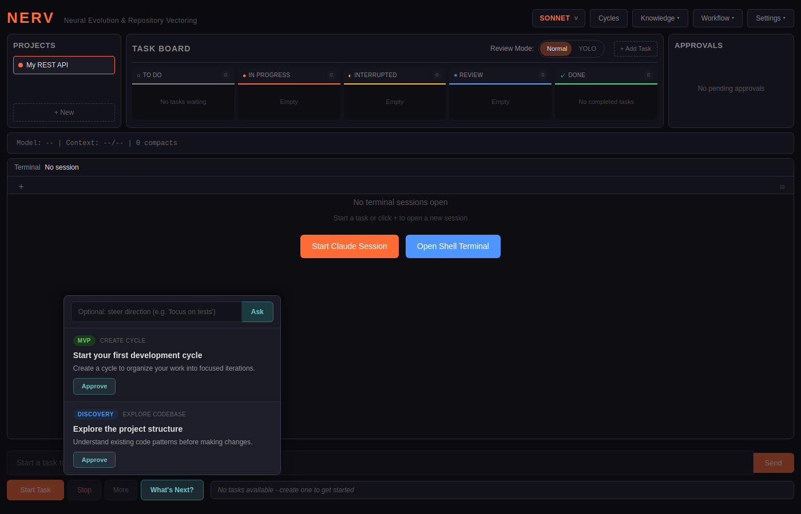

# NERV

<p align="center">
  
</p>

<h3 align="center">
  <strong>Neural Evolution & Repository Vectoring</strong>
</h3>
<p align="center">
  An Electron dashboard that orchestrates <a href="https://github.com/anthropics/claude-code">Claude Code</a> for multi-repository development.
</p>

<!-- Demo: quick-start walkthrough -->
<p align="center">
  <a href="https://gabino75.github.io/nerv/demos">
    <video src="https://gabino75.github.io/nerv/demos/quick-start.webm" width="720" autoplay loop muted>
      Your browser does not support the video tag.
    </video>
  </a>
  <br>
  <em>Write a spec, get recommendations, create tasks, and launch Claude Code — all from one dashboard.
  <a href="https://gabino75.github.io/nerv/demos">Watch all demos</a></em>
</p>

## Overview

NERV is spec-driven AI development. Write a spec defining what you want to build, and NERV orchestrates Claude Code to build it — MVP first, E2E tests always, iterating cycle by cycle until it's done.

You define *what* to build. NERV handles *how*: breaking work into cycles, prioritizing test coverage, managing git worktrees, and keeping Claude on track with AI-guided recommendations at every step.

**Key features:**
- **"What's Next?" recommendations** — Claude analyzes your project and recommends 2-3 ranked next steps. Approve to execute, or give direction to steer.
- **Spec-driven workflow** — write a markdown spec with checkboxes, NERV tracks completion as Claude builds
- **Test-first by design** — MVP scope and E2E tests are prioritized in early cycles
- **Permission control** — approve or deny commands through a hook system with pattern-based rules
- **Git worktree isolation** — every task gets its own branch, your main is never touched
- **YOLO mode** — fully autonomous operation with cost limits and AI-powered code review
- **CLI + GUI** — full functionality via command line or desktop app

## Demos

| Demo | Description |
|------|-------------|
| [Quick Start](https://gabino75.github.io/nerv/demos#quick-start) | Write a spec, get recommendations, start building |
| [YOLO Mode](https://gabino75.github.io/nerv/demos#yolo-mode) | Autonomous development with AI-powered review |
| [Multi-Repo](https://gabino75.github.io/nerv/demos#multi-repository-workflow) | Coordinate work across multiple repositories |

> See all demos at [gabino75.github.io/nerv/demos](https://gabino75.github.io/nerv/demos)

## Quick Start

**Prerequisites:** [Claude Code CLI](https://github.com/anthropics/claude-code) (active subscription), [Git](https://git-scm.com/) 2.20+, Node.js 18+

```bash
git clone https://github.com/gabino75/nerv.git
cd nerv
npm install
npm run dev
```

For a production build: `npm run build`

## Usage

### GUI

Launch with `npm run dev` or run the installed app. Click **"What's Next?"** to get 2-3 ranked recommendations. Click **Approve** to execute them directly — NERV creates cycles, tasks, and other resources for you. Give direction in the input field to steer suggestions. Or take the wheel and do everything manually.



### CLI

```bash
# Claude-guided flow
nerv project create my-app       # Create a project
nerv recommend                   # Get 2-3 ranked recommendations
nerv recommend --direction "focus on tests"  # Steer with direction
nerv cycle create                # Let Claude plan the cycle + tasks
nerv start <taskId>              # Start building
nerv learn "Key insight"         # Record a learning
nerv recommend                   # What's next?

# Manual flow (when you know what you want)
nerv cycle create "Add auth"     # Specific cycle goal
nerv task create "Login endpoint" # Specific task
nerv yolo --cycles 5             # Autonomous mode
```

Run `nerv help` for the full command list, or see the [CLI Reference](https://gabino75.github.io/nerv/cli/).

## Documentation

Full docs at **[gabino75.github.io/nerv](https://gabino75.github.io/nerv/)** — installation guide, feature walkthroughs, architecture, and CLI reference.

## Development

```bash
npm run dev          # Dev mode with hot reload
npm run build        # Production build
npm run typecheck    # TypeScript checks
npm run test:unit    # Unit tests (480+)
```

**Tech stack:** Electron + electron-vite, Svelte 5 + Tailwind CSS, SQLite (better-sqlite3), xterm.js + node-pty, Go permission hook binary.

## License

[MIT](./LICENSE)
