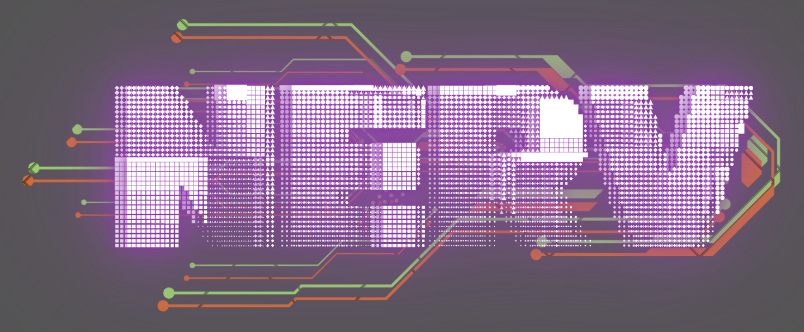

<p align="center">
  
</p>

<h3 align="center">
  <strong>Neural Evolution & Repository Vectoring</strong>
</h3>
<p align="center">
  An Electron dashboard that orchestrates <a href="https://github.com/anthropics/claude-code">Claude Code</a> for multi-repository development.
</p>

<!-- Demo: quick-start walkthrough -->
<p align="center">
  <a href="https://gabino75.github.io/nerv/demos">
    
  </a>
  <br>
  <em>Create a project, add tasks, and launch Claude Code — all from one dashboard</em>
</p>

## Overview

NERV is a single desktop app that manages everything you need when building across multiple repos with Claude Code: terminal sessions, task boards, permission hooks, and development cycles — all in one window.

**Key features:**
- Launch and manage multiple Claude Code sessions simultaneously
- Approve or deny dangerous commands through a permission hook system
- Git worktree isolation — your main branch is never touched directly
- Cycle-based development workflow with task tracking
- YOLO mode for fully autonomous operation with cost limits
- Full CLI alongside the GUI — every feature works headless

## Demos

| Demo | Description |
|------|-------------|
| [Quick Start](https://gabino75.github.io/nerv/demos#quick-start) | Create a project, add tasks, start a Claude session |
| [YOLO Mode](https://gabino75.github.io/nerv/demos#yolo-mode) | Autonomous development with AI-powered review |
| [Multi-Repo](https://gabino75.github.io/nerv/demos#multi-repository-workflow) | Coordinate work across multiple repositories |

> See all demos at [gabino75.github.io/nerv/demos](https://gabino75.github.io/nerv/demos)

## Quick Start

**Prerequisites:** [Claude Code CLI](https://github.com/anthropics/claude-code) (active subscription), [Git](https://git-scm.com/) 2.20+, Node.js 18+

```bash
git clone https://github.com/gabino75/nerv.git
cd nerv
npm install
npm run dev
```

**Pre-built binaries** for Windows and Linux are available on the [Releases](https://github.com/gabino75/nerv/releases) page.

> **macOS:** No pre-built binary yet. Clone the repo and run `npm run dev` or `npm run build && npx electron-builder --mac` to build locally.

## Usage

### GUI

Launch with `npm run dev` or run the installed app. Create a project, point it at your repos, and start a Claude session from the dashboard.

### CLI

```bash
nerv                             # Interactive REPL
nerv project create my-app       # Create a project
nerv start                       # Start a Claude session
nerv task create "Add auth"      # Create a task
nerv yolo --cycles 5             # Autonomous mode (5 cycles)
nerv permissions list             # View permission rules
nerv config list                  # View settings
```

Run `nerv help` for the full command list, or see the [CLI Reference](https://gabino75.github.io/nerv/cli/).

## Documentation

Full docs at **[gabino75.github.io/nerv](https://gabino75.github.io/nerv/)** — installation guide, feature walkthroughs, architecture, and CLI reference.

## Development

```bash
npm run dev          # Dev mode with hot reload
npm run build        # Production build
npm run typecheck    # TypeScript checks
npm run test:unit    # Unit tests (235+)
```

**Tech stack:** Electron + electron-vite, Svelte 5 + Tailwind CSS, SQLite (better-sqlite3), xterm.js + node-pty, Go permission hook binary.

## License

[MIT](./LICENSE)
