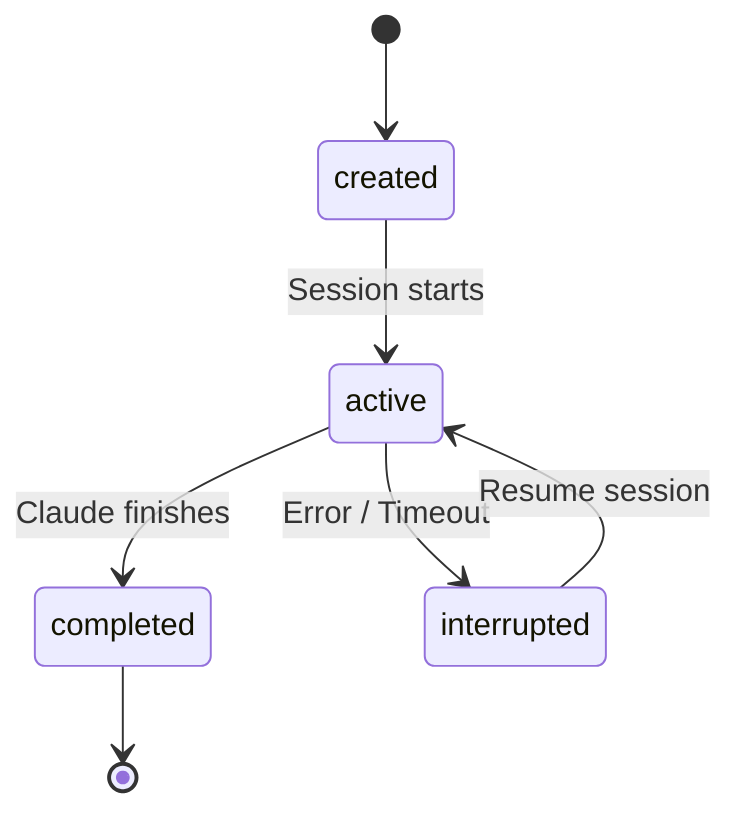

# Claude Integration

NERV integrates with Claude Code CLI for AI-powered development.

## Overview

NERV spawns and manages Claude Code CLI processes:

1. **Build arguments** - Configure Claude with project context
2. **Spawn process** - Launch Claude Code with PTY
3. **Parse output** - Handle stream JSON output
4. **Manage state** - Track sessions, context, metrics

## CLI Arguments

NERV builds Claude CLI arguments via `ClaudeConfig`:

```typescript
const config = new ClaudeConfig({
  projectPath: '/path/to/project',
  taskContext: 'Build login endpoint',
  additionalDirs: ['/path/to/shared'],
  model: 'claude-sonnet-4-20250514',
  resume: 'session_abc123'
})

const args = config.buildArgs()
// ['--output-format', 'stream-json', '--model', 'claude-sonnet-4', ...]
```

### Key Arguments

| Argument | Purpose |
|----------|---------|
| `--output-format stream-json` | Structured output for parsing |
| `--append-system-prompt` | Add NERV.md context |
| `--add-dir` | Multi-repo support |
| `--resume` | Continue previous session |
| `--model` | Specify Claude model |

## NERV.md Context

Each session receives context via NERV.md:

```markdown
# NERV Context

## Current Task
**Title:** Build login endpoint
**Type:** implementation
**Status:** in_progress

## Project Goal
Add OAuth2 authentication to the API

## Cycle Focus
Implement core authentication features

## Learnings
- OAuth requires PKCE for mobile apps
- Use refresh tokens for better security

## Decisions
- JWT with 15-minute expiry
- Store sessions in Redis
```

### Context Generation

Context is generated by `NervMdGenerator`:

```typescript
const generator = new NervMdGenerator(db)
const content = generator.generate(taskId, {
  includeLearnings: true,
  includeDecisions: true,
  maxTokens: 4000
})
```

### Token Management

NERV keeps context small by:

- Summarizing old learnings
- Pruning irrelevant context
- Tracking token usage
- Alerting on context compaction

## Stream JSON Parsing

Claude Code outputs structured JSON:

```json
{"type": "assistant_message", "content": "I'll create the endpoint..."}
{"type": "tool_use", "name": "Edit", "input": {"file": "api.ts", ...}}
{"type": "tool_result", "content": "File edited successfully"}
```

NERV parses this via `StreamParser`:

```typescript
const parser = new StreamParser()

parser.on('message', (msg) => {
  // Update terminal display
})

parser.on('tool_use', (tool) => {
  // Track tool usage
  // Check permissions
})

parser.on('cost', (cost) => {
  // Update session metrics
})
```

## Session State

Sessions are tracked in the database:

```typescript
interface ClaudeSession {
  id: string
  projectId: string
  taskId?: string
  status: 'active' | 'completed' | 'interrupted'
  startedAt: number
  endedAt?: number
  tokensInput: number
  tokensOutput: number
  costUsd: number
}
```

### State Transitions



### Session Resume

To resume a session:

```typescript
// Get previous session
const session = db.getSession(sessionId)

// Build resume args
const config = new ClaudeConfig({
  resume: session.id,
  projectPath: project.path
})

// Spawn with resume
spawnClaude(config.buildArgs())
```

## Permission Integration

When Claude tries to use a dangerous tool:

1. Hook intercepts the tool call
2. NERV checks against rules
3. If no rule matches, prompt user
4. User response sent back to hook
5. Hook allows/denies the tool

```typescript
// Hook sends permission request
ipcMain.on('permission-request', (event, request) => {
  const rule = db.matchRule(request.tool, request.command)

  if (rule) {
    // Rule exists, apply it
    sendResponse(rule.action)
  } else {
    // Show approval dialog
    showApprovalDialog(request)
  }
})
```

## Multi-Repository Support

For projects with multiple repos:

```typescript
const config = new ClaudeConfig({
  projectPath: '/path/to/main-repo',
  additionalDirs: [
    '/path/to/shared-lib',
    '/path/to/frontend'
  ]
})

// Results in: claude --add-dir /path/to/shared-lib --add-dir /path/to/frontend
```

## Error Handling

NERV handles various failure modes:

| Error | Handling |
|-------|----------|
| Claude not found | Show installation instructions |
| Auth failure | Prompt to run `claude auth` |
| Timeout | Mark session interrupted, offer resume |
| Crash | Save state, offer recovery |

## Metrics Collection

Per-session metrics are collected:

```typescript
interface SessionMetrics {
  tokensInput: number
  tokensOutput: number
  costUsd: number
  duration: number
  turns: number
  toolsUsed: Record<string, number>
}
```

These are stored in the database and displayed in the dashboard.
