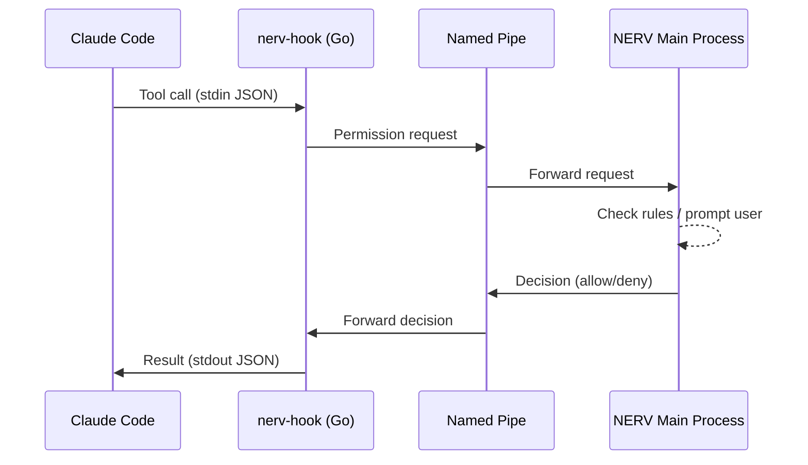
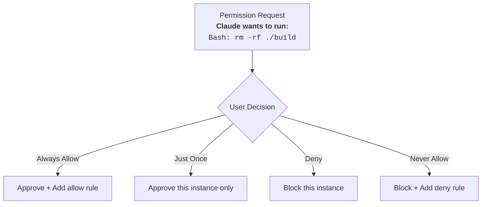

# Permission Hooks

NERV uses hooks to intercept and control Claude Code's tool usage.

## Overview

The hook system:

1. **Intercepts** tool calls before execution
2. **Checks** against permission rules
3. **Prompts** user for approval if needed
4. **Allows/Denies** based on response

## Hook Binary

NERV includes a Go binary (`nerv-hook`) that Claude Code calls:

```
resources/
├── nerv-hook-windows-amd64.exe
├── nerv-hook-darwin-amd64
├── nerv-hook-darwin-arm64
└── nerv-hook-linux-amd64
```

### Building Hooks

```bash
# Windows
npm run build:hooks

# All platforms
npm run build:hooks:all
```

### Hook Source

Located at `cmd/nerv-hook/main.go`:

```go
func main() {
    // Read hook event from stdin
    event := readEvent()

    // Check with NERV main process
    response := checkPermission(event)

    // Output result
    writeResponse(response)
}
```

## Hook Events

Claude Code sends events to hooks:

### pre-tool-use

Called before a tool executes:

```json
{
  "type": "pre-tool-use",
  "tool": "Bash",
  "input": {
    "command": "rm -rf ./build"
  }
}
```

### post-tool-use

Called after a tool executes:

```json
{
  "type": "post-tool-use",
  "tool": "Bash",
  "input": {
    "command": "npm test"
  },
  "result": {
    "output": "All tests passed"
  }
}
```

### stop

Called when session ends:

```json
{
  "type": "stop",
  "reason": "completed"
}
```

## Communication Protocol

The hook communicates with NERV via named pipe:



### Request Format

```json
{
  "id": "req_abc123",
  "type": "pre-tool-use",
  "tool": "Bash",
  "input": {
    "command": "rm -rf ./build"
  }
}
```

### Response Format

```json
{
  "id": "req_abc123",
  "action": "allow"  // or "deny"
}
```

## Permission Rules

Rules are stored in the SQLite database (`~/.nerv/state.db`) and managed via CLI or UI:

```bash
# List all rules
nerv permissions list

# Add an allow rule
nerv permissions add "allow Bash(npm test:*)"

# Add a deny rule
nerv permissions deny "Read(~/.ssh/*)"
```

### Pattern Matching

Rules use glob-style patterns:

| Pattern | Matches |
|---------|---------|
| `*` | Any characters |
| `?` | Single character |
| `[abc]` | Character class |

Examples:
- `Bash(npm test:*)` matches `npm test`, `npm test:unit`
- `Read(src/**/*.ts)` matches any `.ts` file in `src/`

### Rule Priority

1. Deny rules are checked first
2. Allow rules are checked second
3. If no rule matches, prompt user

## Main Process Handler

The main process handles permission requests:

```typescript
// src/main/hooks.ts

ipcMain.on('hook:permission-request', (event, request) => {
  // Check deny rules
  const denyRule = findRule(request, 'deny')
  if (denyRule) {
    return { action: 'deny' }
  }

  // Check allow rules
  const allowRule = findRule(request, 'allow')
  if (allowRule) {
    return { action: 'allow' }
  }

  // No rule - prompt user
  showApprovalDialog(request)
})
```

## Approval Dialog

When no rule matches, NERV shows a dialog:



### Response Actions

| Action | Effect |
|--------|--------|
| Always Allow | Approve + add allow rule |
| Just Once | Approve this instance only |
| Deny | Block this instance |
| Never Allow | Block + add deny rule |

## Learning from History

NERV can suggest rules from approval history:

```typescript
// src/main/hooks.ts

function generatePatternSuggestions(): Suggestion[] {
  const history = db.getApprovalHistory()

  // Group by tool and find common patterns
  const patterns = findCommonPatterns(history)

  return patterns.map(p => ({
    pattern: p.pattern,
    occurrences: p.count,
    action: 'allow'
  }))
}
```

Usage:
```bash
nerv permissions learn
```

## Configuration

Hook settings are in Claude Code's config:

```json
// .claude/settings.json
{
  "hooks": {
    "pre-tool-use": "/path/to/nerv-hook",
    "post-tool-use": "/path/to/nerv-hook",
    "stop": "/path/to/nerv-hook"
  }
}
```

NERV automatically configures this on project initialization.

## Debugging

Enable debug logging:

```bash
NERV_LOG_LEVEL=debug nerv start
```

Hook logs appear in `~/.nerv/logs/hooks.log`.
