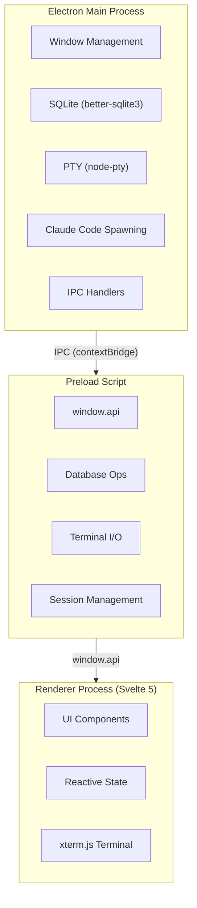
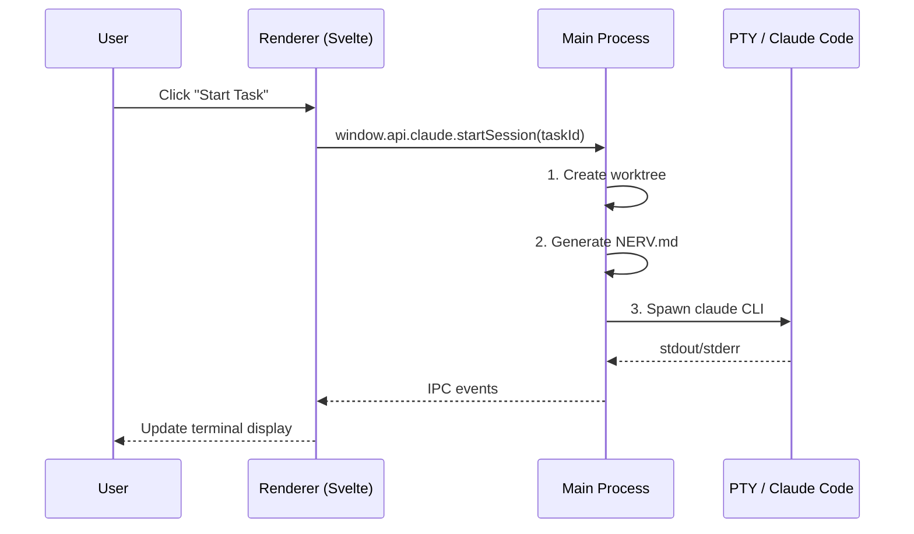
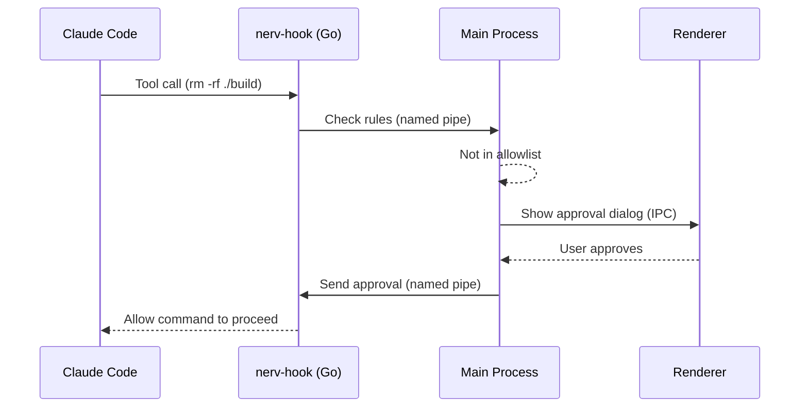
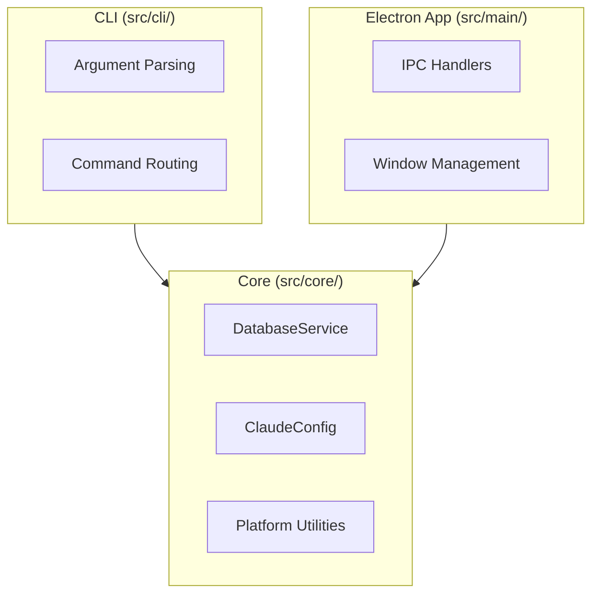

# Architecture Overview

NERV is built as an Electron application with a CLI-first design.

## Process Model

NERV is an Electron app with three process types:



## Tech Stack

| Layer | Technology |
|-------|------------|
| Desktop App | Electron + electron-vite |
| UI Framework | Svelte 5 |
| Styling | Tailwind CSS |
| Database | SQLite (better-sqlite3) |
| Terminal | xterm.js + node-pty |
| Permission Hooks | Go binary |

## Directory Structure

```
src/
├── shared/                 # Shared between all processes
│   ├── types.ts            # Type re-exports
│   ├── types/              # TypeScript interfaces by domain
│   └── constants.ts        # Configuration constants
│
├── core/                   # Platform-agnostic business logic
│   ├── database.ts         # Main DatabaseService class
│   ├── database/           # Database operation modules
│   ├── claude-config.ts    # Claude CLI argument builder
│   └── migrations.ts       # Schema migration definitions
│
├── cli/                    # Command-line interface
│   ├── index.ts            # Entry point
│   └── commands/           # Command implementations
│
├── main/                   # Electron main process
│   ├── index.ts            # Entry point, window creation
│   ├── terminal.ts         # PTY process management
│   ├── claude.ts           # Claude session orchestration
│   └── ipc/                # IPC handler modules
│
├── preload/                # Context bridge
│   ├── index.ts            # Main preload script
│   └── api/                # API modules
│
└── renderer/               # Svelte UI
    └── src/
        ├── App.svelte
        ├── app.css
        ├── stores/
        └── components/
```

## Data Flow

### Starting a Task



### Permission Flow



## Key Components

### Database Service

The `DatabaseService` class handles all SQLite operations:

- 18 tables for projects, tasks, sessions, etc.
- Automatic migrations on startup
- WAL mode for better concurrency

[Database Details](/architecture/database)

### Claude Integration

Claude Code integration handles:

- CLI argument building
- Stream JSON parsing
- Session state management
- Context generation (NERV.md)

[Claude Integration Details](/architecture/claude-integration)

### Permission Hooks

The Go-based hook system:

- Intercepts pre-tool-use events
- Checks against permission rules
- Communicates with main process

[Hook Details](/architecture/hooks)

## CLI Architecture

The CLI shares core logic with the Electron app:



Both CLI and Electron share the same core logic, ensuring feature parity.
