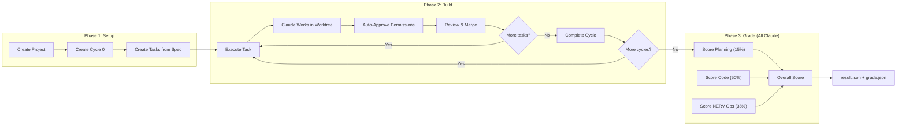

# Benchmark Architecture

Comprehensive reference for NERV's automated benchmark system — a 3-phase pipeline that exercises the full orchestration stack and grades the result.

## Overview

The benchmark system automates the entire NERV workflow: creating projects, planning cycles, executing tasks with Claude, reviewing changes, and grading the output. It runs in Docker with mock or real Claude, producing detailed metrics and artifacts.

## Pipeline



## UIBenchmarkRunner

The core class in `test/e2e/helpers/ui-benchmark.ts` orchestrates the 3-phase pipeline.

### Configuration

```typescript
interface UIBenchmarkConfig {
  specFile: string              // Spec markdown file
  scenario: UserScenario        // User profile + milestones
  testRepoPath: string          // Path to test repository
  outputDir: string             // Where to write artifacts
  taskTimeout?: number          // Default: 15 min per task
  cycleTimeout?: number         // Default: 45 min per cycle
  totalTimeout?: number         // Default: 3 hours total
  autoApproveAll?: boolean      // Auto-approve all permissions
  maxReviewIterations?: number  // Default: 3 review rounds
  reviewMode?: 'auto' | 'human' | 'none'  // Review strategy
}
```

### Phase 1: Setup

Creates the project infrastructure:

1. Creates a project with the test repository
2. Starts Cycle 0 via UI or database API
3. Creates initial tasks from the user scenario's milestones
4. Returns `projectId`, `cycleId`, `taskIds`

### Phase 2: Build

Executes tasks in a loop:

1. **Start task** — clicks "Start Task" button
2. **Approval watcher** — background `setInterval` auto-resolves permissions in the database
3. **Wait for completion** — polls database with sync flag pattern (not async `waitForFunction`)
4. **Loop detection** — auto-dismisses loop detection dialogs via `[data-testid="loop-continue-btn"]`
5. **Review** — AI review via `claude --print` or auto-approve depending on `reviewMode`
6. **Merge** — merges worktree back to main branch
7. **Mid-project events** — handles scope creep, user feedback, mind changes
8. **Cycle transitions** — completes cycles, creates new ones for up to 5 cycles

### Phase 3: Grade

All 3 scoring categories are Claude-graded. In mock mode, fixed passing scores are returned without calling Claude.

| Category | Weight | Scoring Method |
|----------|--------|----------------|
| Planning | 15% | Claude-graded — cycle progression, task decomposition, spec coverage |
| Code Quality | 50% | Claude-graded — implementation quality, functionality, UX |
| NERV Ops | 35% | Claude-graded — workflow patterns compared against PRD |

**Mock mode:** When `NERV_MOCK_CLAUDE=1` or `NERV_TEST_MODE=1`, all 3 categories return a fixed score of 8/10 without calling Claude. This keeps E2E tests fast and deterministic.

**Pass threshold:** overall >= 7.0 (exit code 0), below 7.0 (exit code 1)

## Grading Scheme

### Planning Score (15%)

Claude evaluates:
- Were cycles well-scoped and progressive?
- Were tasks appropriately decomposed?
- Did spec coverage increase across cycles?
- Were decisions and learnings captured?
- Was there evidence of adaptive planning?

### Code Quality Score (50%)

Claude evaluates:
- Code organization, structure, naming
- Test coverage and quality
- Type safety and error handling
- Functionality — does it match the spec?
- UX — does the app work, is it intuitive?

Visual test results (if available) are included in the code quality prompt.

### NERV Ops Score (35%)

Claude compares the observed workflow against the NERV PRD:
- **Worktree isolation** — separate worktrees per task, merged on approval
- **Cycle-based iteration** — progressive cycles with increasing spec completion
- **Permission management** — permissions requested and resolved (not bypassed)
- **Review gates** — review before merge, feedback acted upon
- **Error recovery** — loop handling, stuck detection, graceful recovery
- **Cost efficiency** — reasonable cost relative to complexity

The PRD workflow excerpt is embedded in the scoring prompt so Claude has a reference standard.

## Scoring Script

`scripts/score-benchmark.js` provides standalone scoring outside the benchmark runner:

```bash
# Score with Claude (3 calls: planning, code, NERV ops)
node scripts/score-benchmark.js benchmark-output/ --spec specs/todo-app.md

# Mock mode (fixed scores, no Claude calls)
NERV_MOCK_CLAUDE=1 node scripts/score-benchmark.js benchmark-output/
```

**Output:**
- `score-report.json` — full scoring breakdown
- `summary.json` — updated with embedded scores
- `~/.nerv/benchmarks/history.jsonl` — benchmark history entry

## Output Artifacts

Each benchmark run produces:

```
benchmark-output/
├── result.json               # 3-phase execution summary
├── grade.json                # Scores (planning/code/ops/overall)
├── event-log.jsonl           # Timestamped events for video analysis
├── worktree-manifest.json    # Task-to-worktree mapping
├── summary.json              # Metadata + metrics + scores
├── score-report.json         # Detailed scoring breakdown
└── repo/                     # Merged built repository
```

### event-log.jsonl

Timestamped events for post-processing and video overlay:

```json
{"t": 1234, "event": "task_started", "region": "action-bar", "label": "Task abc123"}
{"t": 2000, "event": "claude_thinking", "action": "speed-up", "factor": 3}
{"t": 5000, "event": "task_completed", "label": "Task abc123"}
```

### grade.json

```json
{
  "planningScore": 8.5,
  "codeScore": 7.2,
  "nervOpsScore": 9.0,
  "overallScore": 7.9,
  "pass": true
}
```

## Docker Architecture

### Why Docker

- **Isolation** — hermetic test environment, no host pollution
- **Consistency** — same OS, dependencies, and display server across machines
- **Xvfb** — headless Electron requires a virtual display

### Dockerfile Layers

```
playwright:v1.50.0-noble (base)
  └─ System deps (xvfb, ffmpeg, build-essential)
    └─ Claude Code CLI
      └─ npm install (app dependencies)
        └─ Rebuild native modules (better-sqlite3, node-pty for Electron 35+)
```

### Entrypoint Flow

1. Sync source from host mount (`/app/host` → `/app`)
2. Initialize test fixture repos (git init + commit)
3. Build app (or use pre-built artifacts)
4. Start Xvfb on `:99` at 1920x1080
5. Warm up Electron
6. Run tests (Playwright records video automatically when configured)
7. Copy results back to host mount

### Compose Services

| Service | Description |
|---------|-------------|
| `nerv-e2e-mock` | Headless, mock Claude, no credentials needed |
| `nerv-e2e-headed` | X11 forwarding for visible UI debugging |
| `nerv-e2e-real` | Real Claude CLI (uses host login credentials) |
| `nerv-e2e-simple` | Single test filter for debugging |

## Test Entry Points

| Test File | Mode | Timeout | Description |
|-----------|------|---------|-------------|
| `benchmark.spec.ts` | Mock | 5 min | 3-phase UIBenchmarkRunner with mock Claude |
| `scored-benchmark.spec.ts` | Mock | 5 min | Full workflow with comprehensive output artifacts |
| `real-claude-benchmark.spec.ts` | Real | 45 min | Real Claude, YOLO mode, full autonomous build |
| `full-workflow.spec.ts` | Both | 2-10 min | UI interaction demo and verification |

## Environment Variables

| Variable | Default | Description |
|----------|---------|-------------|
| `NERV_MOCK_CLAUDE` | `true` | Use mock Claude responses |
| `NERV_TEST_MODE` | — | Enable test-specific behavior |
| `NERV_SLOW_MODE` | `false` | Add delays for observation |
| `NERV_BENCHMARK_MODE` | — | Enable benchmark instrumentation |
| `NERV_CLAUDE_TIMEOUT` | `3600000` | Per-task timeout (ms) |
| `NERV_MAX_TURNS` | `10` (mock) | Max conversation turns |
| `DISPLAY` | `:99` | Xvfb virtual display |

## Running Benchmarks

### Mock (fast, no API key needed)

```bash
# Via Docker Compose
docker compose -f test/e2e/docker-compose.yml run nerv-e2e-mock

# Or directly
docker run --rm --shm-size=2gb \
  -v $(pwd):/app/host \
  -e NERV_MOCK_CLAUDE=true \
  nerv-e2e "npx playwright test test/e2e/golden/scored-benchmark.spec.ts"
```

### Real Claude

Real Claude benchmarks use the host system's Claude Code login credentials (mounted into the container). No API key is needed — Claude Code uses your existing subscription.

```bash
# Via Docker Compose (mounts ~/.claude credentials automatically)
docker compose -f test/e2e/docker-compose.yml run nerv-e2e-real

# Or manually mount credentials
docker run --rm --shm-size=2gb \
  -v $(pwd):/app/host \
  -v ~/.claude:/root/.claude:ro \
  -e NERV_MOCK_CLAUDE=false \
  nerv-e2e "npx playwright test test/e2e/golden/real-claude-benchmark.spec.ts"
```

### Scoring an existing output

```bash
# All-Claude scoring (3 separate Claude calls)
node scripts/score-benchmark.js path/to/benchmark-output/ --spec specs/todo-app.md

# Mock mode (fixed scores, no Claude calls)
NERV_MOCK_CLAUDE=1 node scripts/score-benchmark.js path/to/benchmark-output/
```
