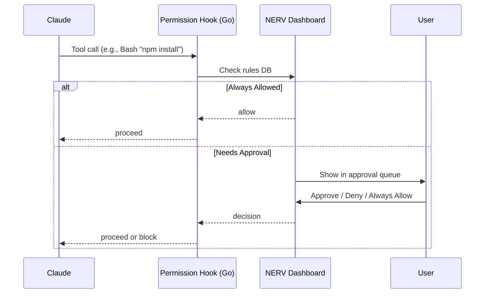

# Permission System

NERV intercepts potentially dangerous commands and requires approval before execution.

## How It Works

1. NERV configures hooks in Claude Code's settings
2. When Claude wants to run a command, the hook intercepts it
3. NERV checks against permission rules
4. If not pre-approved, you're prompted in the UI
5. Your response is recorded and can become a rule



## Permission Requests

When a permission request appears:

1. Review the **command** and **context**
2. See what **tool** Claude wants to use
3. Choose an action:

| Action | Effect |
|--------|--------|
| **Always Allow** | Approve and add to allowlist |
| **Just Once** | Approve this instance only |
| **Deny** | Block this instance |
| **Never Allow** | Block and add to denylist |

## Permission Rules

Rules use pattern matching to match commands:

```
Bash(npm test:*)       # Allow any npm test command
Bash(npm run build)    # Allow specific npm command
Bash(rm -rf ./build)   # Allow specific rm command
Read(~/.ssh/*)         # Deny reading SSH keys
Write(/etc/*)          # Deny writing to /etc
```

### Pattern Syntax

| Pattern | Matches |
|---------|---------|
| `*` | Any characters |
| `?` | Single character |
| `[abc]` | Character class |

### Tool Types

Rules apply to specific tool types:

| Tool | Commands |
|------|----------|
| `Bash` | Shell commands |
| `Read` | File reading |
| `Write` | File writing |
| `Edit` | File editing |

## Managing Rules

### Via UI

Open **Settings > Permissions** to:
- View all rules
- Add new rules
- Remove rules
- Toggle rules on/off

### Via CLI

```bash
# List rules
nerv permissions list

# Add an allow rule
nerv permissions add "allow Bash(npm test:*)"

# Add a deny rule
nerv permissions deny "Read(~/.ssh/*)"

# Remove a rule
nerv permissions remove <id>
```

All permission rules are stored in the SQLite database (`~/.nerv/state.db`), not in separate JSON files.

## Learning from History

NERV can suggest rules based on your approval history:

```bash
nerv permissions learn
```

This analyzes past approvals and suggests patterns:

```
Suggested rules based on 47 approvals:

1. Bash(npm test:*) - Approved 12 times
2. Bash(git status) - Approved 8 times
3. Read(src/**/*.ts) - Approved 15 times

Add these rules? [y/n]
```

## Default Rules

NERV comes with sensible defaults:

**Allowed by default:**
- `Read` - Reading any file
- `Grep` - Searching files
- `Glob` - Finding files

**Denied by default:**
- `Bash(rm -rf /)` - Delete root
- `Read(~/.ssh/*)` - SSH keys
- `Write(~/.*)` - Hidden files

## Best Practices

1. **Start restrictive** - Allow as needed
2. **Use patterns** - `npm test:*` vs individual commands
3. **Review learnings** - Suggested rules may be too broad
4. **Audit regularly** - Remove unused rules
