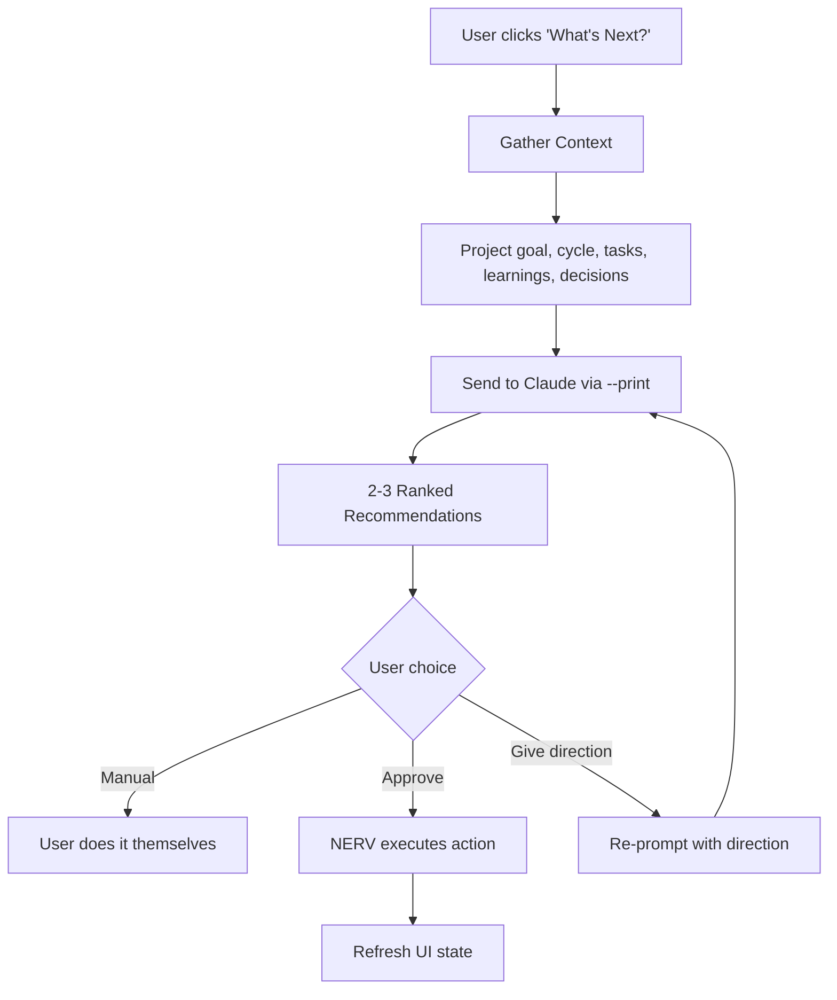

# What's Next? (Recommendations)

The **"What's Next?"** feature is NERV's primary workflow driver. It analyzes your project state and recommends 2-3 ranked next steps that you can approve and execute directly.


## How It Works



## Three Modes

| Mode | How | When |
|------|-----|------|
| **Approve** | Click "Approve" on a recommendation | Starting out, trusting Claude's judgment |
| **Give direction** | Type in the direction field, then Ask | When you have a specific focus in mind |
| **Manual** | Read the recommendation, do it yourself | When you want full control |

## Context Gathered

Each recommendation is informed by:

- **Project goal** — what you're building
- **Active cycle** — current cycle number and goal
- **Tasks** — status of all tasks (todo, in progress, done)
- **Learnings** — last 5 learnings from previous cycles
- **Decisions** — last 5 architectural decisions
- **User direction** — optional text you provide to steer suggestions

## Recommendation Actions

NERV supports 12 recommendation actions across the development lifecycle:

| Action | What NERV Does | Phase |
|--------|---------------|-------|
| `create_project_goal` | UI prompts to set project goal | Discovery |
| `create_cycle` | Creates a new cycle with suggested goal | Discovery/MVP |
| `create_task` | Creates a task in the active cycle | MVP/Building |
| `start_task` | Starts the next todo task (worktree + Claude) | Building |
| `resume_task` | Resumes an interrupted task | Building |
| `review_task` | Puts task in review status | Building |
| `approve_task` | Marks task as done | Building |
| `complete_cycle` | Completes the active cycle | Building |
| `run_audit` | Opens the audit panel | Building/Polish |
| `record_learning` | Records a learning with content | Polish |
| `explore_codebase` | Starts exploration session | Discovery |
| `write_tests` | Creates a test-writing task | MVP/Polish |

## Phase Progression

Recommendations include a phase indicator showing where you are in the lifecycle:

| Phase | Color | Meaning |
|-------|-------|---------|
| **Discovery** | Blue | Exploring, understanding, setting goals |
| **MVP** | Green | Building core functionality, first tests |
| **Building** | Teal | Iterating on features, expanding scope |
| **Polish** | Purple | Cleanup, edge cases, documentation |
| **Done** | Green | Spec is complete |

## Parameters

Some recommendations include pre-filled parameters:

- `cycleGoal` — suggested goal when creating a cycle
- `taskTitle` / `taskDescription` / `taskType` — details when creating a task
- `taskId` — which task to start or resume
- `learningContent` — what to record as a learning

When you click **Approve**, these parameters are used to execute the action automatically.

## CLI Usage

```bash
# Get recommendations (default)
nerv recommend

# Steer with direction
nerv recommend --direction "focus on error handling"

# JSON output for scripting
nerv recommend --json
```

Example output:

```
What's Next?
──────────────────────────────────────────────────

  1. Create your first development cycle
     Phase: mvp  |  Action: create_cycle
     Your spec is ready but no cycles exist yet.
     How: Create a cycle focused on MVP scope with E2E tests.

  2. Set up the project goal
     Phase: discovery  |  Action: create_project_goal
     A clear goal helps Claude focus recommendations.
     How: Update the project with a specific, measurable goal.

──────────────────────────────────────────────────
```

## How Recommendations Are Generated

1. NERV gathers context from the SQLite database
2. Builds a structured prompt with the NERV development lifecycle rules
3. Calls `claude --print --model sonnet --max-turns 1` for a fast one-shot response
4. Parses the JSON response into 2-3 ranked recommendations
5. Displays them in the UI with phase badges and approve buttons
