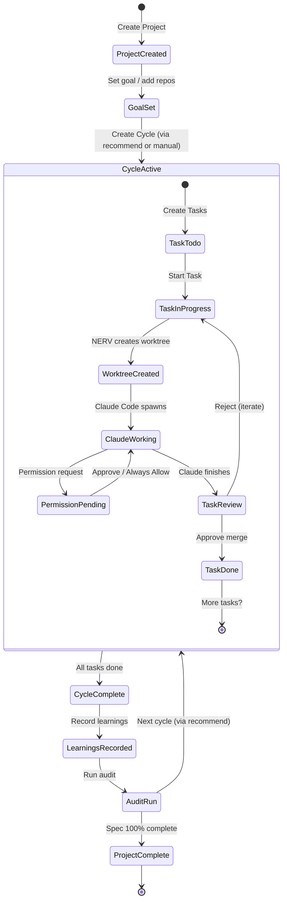

# Core Concepts

Understanding NERV's key concepts will help you work more effectively.

## Project Lifecycle

The complete NERV development flow from project creation to completion:



## Projects

A **Project** represents a development goal that may span one or more repositories.

- Each project has its own tasks, sessions, and learnings in the database
- Projects are isolated - work on multiple projects simultaneously
- Multi-repo projects use `--add-dir` to give Claude access to all repos

```bash
# Create a project
nerv project create "OAuth Feature"

# List all projects
nerv project list

# Switch between projects
nerv project switch <id>
```

## Tasks

A **Task** is a single unit of work. Tasks follow a Kanban workflow:

| Status | Description |
|--------|-------------|
| `todo` | Not yet started |
| `in_progress` | Currently being worked on |
| `interrupted` | Paused mid-work |
| `review` | Ready for review |
| `done` | Completed |

### Task Types

| Type | Use For |
|------|---------|
| `implementation` | Building or modifying code |
| `research` | Investigation, documentation |
| `debug` | Finding and fixing bugs |
| `refactor` | Improving code structure |

```bash
# Create a task
nerv task create "Implement login endpoint" --type implementation

# Update status
nerv task update <id> --status review
```

## Cycles

A **Cycle** is a logical grouping of related tasks. Cycles help you:

- Focus on a specific goal
- Capture learnings along the way
- Know when to step back and review

```bash
# Create a cycle
nerv cycle create "Authentication MVP"

# Complete with learnings
nerv cycle complete --learnings "OAuth patterns established"

# Run a code health audit
nerv cycle audit
```

## Worktrees

NERV uses **git worktrees** to isolate task work:

- Each task gets its own worktree with a unique branch
- Your main branch is never directly modified
- Branch naming: `nerv/{taskId}-{timestamp}`
- Worktrees are created adjacent to your repo: `{repo-parent}/{repo-name}-worktrees/`

Benefits:
- Work on multiple tasks in parallel without conflicts
- Safely abandon work without affecting main
- Review changes before merging

## Context (NERV.md)

Claude Code sessions receive context via NERV.md, which includes:

- Current task description and acceptance criteria
- Project goal and cycle focus
- Learnings from previous cycles
- Key decisions (ADRs)

NERV tracks token usage and keeps context small by:
- Summarizing old learnings
- Pruning irrelevant context
- Notifying you when context is compacted

## Sessions

A **Session** is a Claude Code conversation. Sessions can be:

- **Task-linked** - Associated with a specific task
- **Standalone** - For exploration and research
- **Resumed** - Continue a previous conversation

```bash
# Start a task session
nerv start <taskId>

# Resume a previous session
nerv resume --session <sessionId>

# List sessions
nerv sessions

# Fork a session for experimentation
nerv session fork --name "experiment"
```

## Permission Rules

NERV intercepts dangerous commands using hooks. Rules use pattern matching:

```
Bash(npm test:*)     # Allow any npm test command
Bash(rm -rf ./build) # Allow specific rm command
Read(~/.ssh/*)       # Deny reading SSH keys
```

Rules are stored in the SQLite database and can be managed via CLI or UI:

```bash
# List rules
nerv permissions list

# Add a rule
nerv permissions add "allow Bash(npm test:*)"

# Learn suggested rules from approval history
nerv permissions learn
```

## Settings

Settings are stored in the SQLite database and managed via the CLI or UI:

```bash
# View all settings with sources
nerv config list

# Set a value (global)
nerv config set monthly_budget_usd 50

# Set a project-level value
nerv config set theme dark --project

# Get a specific setting
nerv config get monthly_budget_usd
```

Settings can also be overridden with environment variables using the `NERV_` prefix (e.g., `NERV_LOG_LEVEL=debug`).
